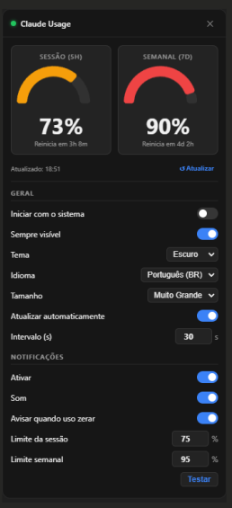
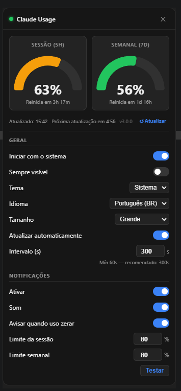
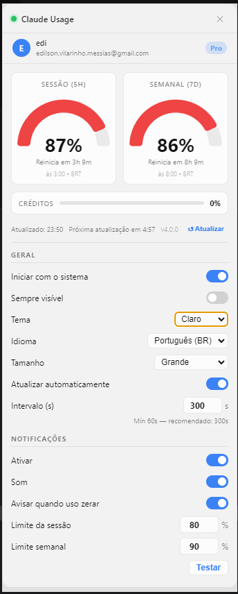
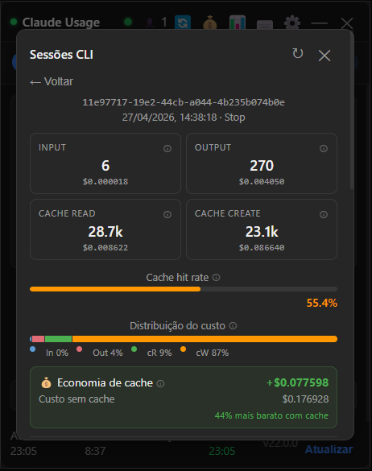
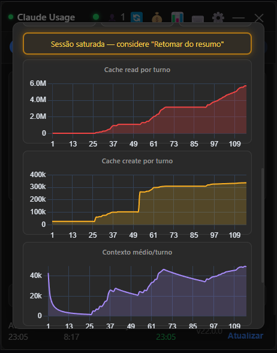
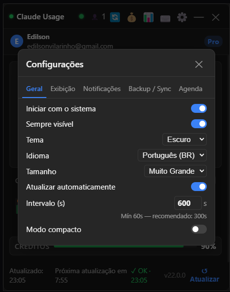
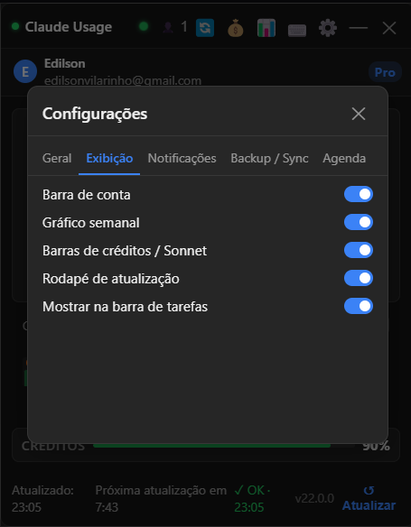
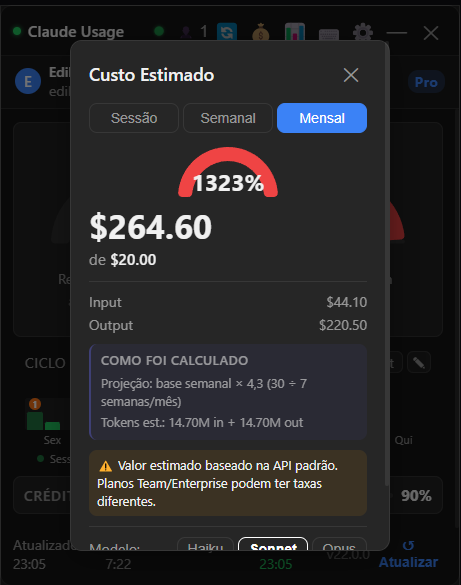
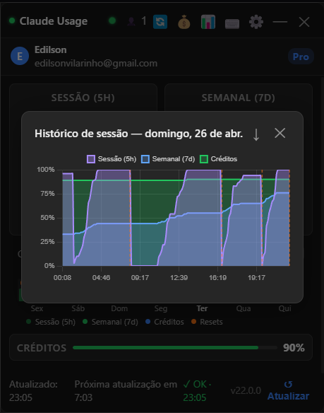

# Claude Usage Monitor

Aplicativo Windows para a bandeja do sistema que monitora seus limites de uso da IA Claude em tempo real — sem precisar do CLI do Claude ou de qualquer configuração adicional.












---

## Funcionalidades

### Medidores de Uso
- **Sessão (5h)** e **Semanal (7d)** — velocímetros semicirculares mostrando a utilização atual de forma imediata
- Código de cores progressivo: verde → amarelo (60%) → vermelho (80%)
- Exibe o tempo restante até cada janela de uso ser reiniciada
- Barras opcionais para uso do modelo **Sonnet** e **créditos extras** (exibidas apenas quando a conta possui créditos adicionais)

### Ícone na Bandeja do Sistema
- Anel de progresso circular ao vivo na bandeja do sistema, refletindo o maior valor entre os dois medidores
- Exibe o número percentual dentro do ícone
- Mostra `!!!` quando o uso ultrapassa 100%
- Ícone **adaptativo**: fundo escuro ou claro conforme o tema do sistema (detectado via `prefers-color-scheme`)
- Tooltip ao passar o mouse exibe os percentuais de sessão e semanal, horário do próximo poll e versão instalada

### Atualização Automática
- Polling automático da API com intervalos adaptativos:
  - **Normal:** 10 minutos
  - **Modo rápido (7 min):** ativado por 1 ciclo quando detecta pico de uso superior a 1%
  - **Modo ocioso (30 min):** ativado quando o sistema está inativo por mais de 10 minutos
  - **Erro de rede:** backoff de 1min × 2ⁿ, máximo 20 min
- **Auto-refresh configurável:** intervalo customizado via slider nas configurações (mín. 60s; recomendado 300s)
- **Pause/Resume:** pausar e retomar o monitoramento via menu da bandeja do sistema

### Hotkey Global
- `Ctrl+Shift+U` abre/fecha o popup de qualquer lugar da área de trabalho

### Gerenciamento de Rate Limit
- Quando a API retorna erro 429, o app para as tentativas imediatamente e exibe um banner de contagem regressiva
- Backoff exponencial em rate limits consecutivos: `5m → 10m → 20m → 40m → 60m` (limite máximo)
- Respeita o header `Retry-After` ou `X-RateLimit-Reset` quando a API os fornece
- A contagem regressiva e o estado de backoff **sobrevivem a reinicializações do app** — ao reabrir, o tempo correto restante é exibido
- Retoma o polling normal automaticamente quando o período de espera expira

### Notificações
- Toast nativo do Windows quando o uso ultrapassa o limiar configurado (sessão e/ou semanal)
- Alerta sonoro opcional
- Notificação quando uma janela de uso é reiniciada
- Botão de teste para visualizar a notificação antes de configurar
- Debounce inteligente — não notifica novamente até o uso cair abaixo do threshold de reset
- **Thresholds configuráveis via slider:** sessão (%), semanal (%) e threshold de reset (%)

### Histórico de Uso (24h)
- Sparkline colapsável com duas linhas: Sessão (verde) e Semanal (azul)
- Dados das últimas 24h, buscados via IPC a cada abertura

### Gráfico de Ciclo Semanal
- Gráfico de barras mostrando os **últimos 8 dias** do ciclo semanal atual
- **Duas barras por dia:** Sessão (verde) e Semanal (azul), sempre visíveis
- **Terceira barra opcional:** Créditos extras (azul adicional), exibida quando a conta tem créditos
- Código de cores progressivo por barra (ok / warn / crit) independente
- Tooltip em cada coluna com percentuais de sessão, semanal, créditos e número de resets de sessão acumulados
- Legenda de cores dentro da seção do gráfico
- **Edição manual de snapshots:** clique duplo em qualquer coluna para corrigir dados registrados

### Backup e Importação de Dados
- **Backup manual:** botão "Backup" na tela de histórico gera um arquivo `bk_DD_MM_YYYY_HH_MM.json` na pasta `%APPDATA%\Claude Usage Monitor\backups\`
- **Backup automático:** via menu da bandeja do sistema — cria backup sob demanda
- **Importação:** botão "Import" abre file dialog para selecionar um backup anterior e mesclar com os dados atuais (dados existentes são preservados e mesclados)
- Retenção automática: mantém apenas os 8 backups mais recentes

### Dados por Conta
- Histórico de uso, rate limit e dados do ciclo semanal são **isolados por conta** (chaveados pelo e-mail da conta Anthropic)
- Trocar de conta não mistura dados históricos

### Tamanhos de Janela Configuráveis
Quatro tamanhos disponíveis — escala os gráficos dos medidores:

| Tamanho | Descrição |
|---|---|
| Normal | Compacto |
| Médio | Medidores ligeiramente maiores |
| Grande | Medidores grandes, fácil leitura (padrão) |
| Muito Grande | Tamanho máximo dos medidores |

### Janela Movível
Arraste o popup para qualquer lugar da tela — ele permanece onde você o deixou. Retorna acima do ícone da bandeja somente ao fechar e reabrir o app.

### Temas
- **Sistema** — segue o modo claro/escuro do Windows automaticamente
- **Escuro**
- **Claro**

Efeito de desfoque Acrylic nativo do Windows 11 no fundo do popup.

### Idiomas
- English
- Português (BR)

### Configurações Gerais
- **Iniciar com o Windows** — registra no `HKCU\Run` para iniciar automaticamente com o sistema
- **Sempre visível** — desativa o auto-ocultar ao perder o foco

### Verificação de Atualizações
- Verifica automaticamente novas versões uma vez por dia via GitHub Releases
- Exibe toast de notificação e banner no popup quando há atualização disponível
- Não bloqueia o app em caso de falha na verificação (falha silenciosa)

---

## Cloud Sync (Opcional)

Sincronize o histórico de uso entre múltiplas máquinas usando o backend opcional integrado ao repositório.

**O comportamento padrão não muda** — todos os dados permanecem locais. O Cloud Sync é opt-in.

### Como habilitar
1. Faça o deploy ou rode o servidor de sync (veja `server/README.md`)
2. Abra o app → Configurações → Cloud Sync
3. Informe a URL do servidor e clique em "Sign in & enable"
4. A autenticação usa suas credenciais OAuth do Claude existentes — sem conta separada

### Privacidade
O servidor armazena apenas dados agregados de uso (picos diários, janelas de sessão, séries temporais). Nenhum conteúdo de conversa é transmitido.

Consulte [server/README.md](server/README.md) para instruções de self-hosting.

---

## Como Funciona

O Claude Usage Monitor lê as credenciais diretamente do arquivo `~/.claude/.credentials.json` — o mesmo arquivo usado pelo Claude CLI — e chama a API da Anthropic com seu token OAuth. **Não é necessária nenhuma chave de API**: se você tem o Claude CLI instalado e está logado, o app simplesmente funciona.

O token OAuth é **renovado automaticamente** quando está próximo do vencimento (margem de 5 minutos).

O app também suporta instalações via **WSL (Windows Subsystem for Linux)**: ele busca automaticamente credenciais em todos os caminhos WSL disponíveis (`\\wsl.localhost\<distro>\home\<user>\.claude\`) e utiliza o arquivo modificado mais recentemente.

---

## Instalação

Baixe a versão mais recente na página de [Releases](../../releases):

- **`Claude Usage Monitor Setup.exe`** — instalador NSIS com opção de diretório customizável
- **`Claude Usage Monitor.exe`** — portátil, sem instalação necessária

### Compilar a partir do Código Fonte

**Requisitos:** Node.js 18+, Windows

```bash
git clone https://github.com/edilsonvilarinho/claude-usage-monitor
cd claude-usage-monitor
npm install

# Executar em modo de desenvolvimento
npm run dev

# Compilar (main + renderer)
npm run build

# Gerar instalador NSIS + EXE portátil
npm run dist

# Somente EXE portátil
npm run dist:portable

# Gerar tudo e zipar para release
npm run release
```

### Testes E2E (Playwright)

Na primeira vez, instale os browsers do Playwright:

```bash
npx playwright install
```

```bash
# Rodar todos os testes (54 TCs) e exibir resultado no terminal
npm run test:e2e

# Ver relatório HTML detalhado após rodar (screenshots, trace em falhas)
npm run test:e2e
npm run test:e2e:report

# Interface gráfica interativa — recomendado para debug
npm run test:e2e:ui
```

---

## Requisitos

- Windows 10 / 11
- [Claude CLI](https://claude.ai/download) instalado e com sessão ativa (`~/.claude/.credentials.json` deve existir)

---

## Privacidade

Todos os dados ficam locais. O app realiza apenas requisições para `api.anthropic.com` usando seu token OAuth existente do Claude — as mesmas requisições que o próprio CLI do Claude faz. **Sem telemetria, sem serviços de terceiros.**

---

## Licença

MIT
